---
## Front matter
title: "Отчет по выполнению лабораторной работы №7"
subtitle: "Дисциплина: архитектура компьютеров"
author: "Новиков Никита Владимирович"

## Generic otions
lang: ru-RU
toc-title: "Содержание"

## Bibliography
bibliography: bib/cite.bib
csl: pandoc/csl/gost-r-7-0-5-2008-numeric.csl

## Pdf output format
toc: true # Table of contents
toc-depth: 2
lof: true # List of figures
lot: true # List of tables
fontsize: 12pt
linestretch: 1.5
papersize: a4
documentclass: scrreprt
## I18n polyglossia
polyglossia-lang:
  name: russian
  options:
	- spelling=modern
	- babelshorthands=true
polyglossia-otherlangs:
  name: english
## I18n babel
babel-lang: russian
babel-otherlangs: english
## Fonts
mainfont: PT Serif
romanfont: PT Serif
sansfont: PT Sans
monofont: PT Mono
mainfontoptions: Ligatures=TeX
romanfontoptions: Ligatures=TeX
sansfontoptions: Ligatures=TeX,Scale=MatchLowercase
monofontoptions: Scale=MatchLowercase,Scale=0.9
## Biblatex
biblatex: true
biblio-style: "gost-numeric"
biblatexoptions:
  - parentracker=true
  - backend=biber
  - hyperref=auto
  - language=auto
  - autolang=other*
  - citestyle=gost-numeric
## Pandoc-crossref LaTeX customization
figureTitle: "Рис."
tableTitle: "Таблица"
listingTitle: "Листинг"
lofTitle: "Список иллюстраций"
lotTitle: "Список таблиц"
lolTitle: "Листинги"
## Misc options
indent: true
header-includes:
  - \usepackage{indentfirst}
  - \usepackage{float} # keep figures where there are in the text
  - \floatplacement{figure}{H} # keep figures where there are in the text
---

# Цель работы

Изучение команд условного и безусловного переходов. Приобретение навыков написания
программ с использованием переходов. Знакомство с назначением и структурой файла
листинга

# Задание

1. Реализация переходов в NASM
2. Изучение структуры файлы листинга

# Теоретическое введение

Для реализации ветвлений в ассемблере используются так называемые команды передачи
управления или команды перехода. Можно выделить 2 типа переходов:
• условный переход – выполнение или не выполнение перехода в определенную точку
программы в зависимости от проверки условия.
• безусловный переход – выполнение передачи управления в определенную точку про-
граммы без каких-либо условий.
Листинг (в рамках понятийного аппарата NASM) — это один из выходных файлов, созда-
ваемых транслятором. Он имеет текстовый вид и нужен при отладке программы, так как
кроме строк самой программы он содержит дополнительную информацию.

# Выполнение лабораторной работы

##Реализация переходов в NASM

Открываю терминал и создаю каталог для программ лабораторной работы, перехожу в него и создаю файл lab7-1.asm (рис. [-@fig:001]).

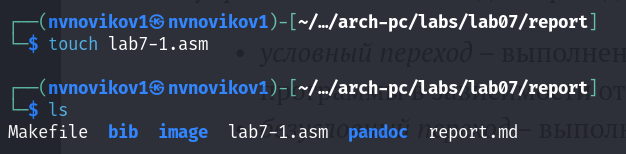{#fig:001 width=70%}

Ввожу в файл lsb7-1.asm текст программы из листинга 7.1.(рис. [-@fig:002])

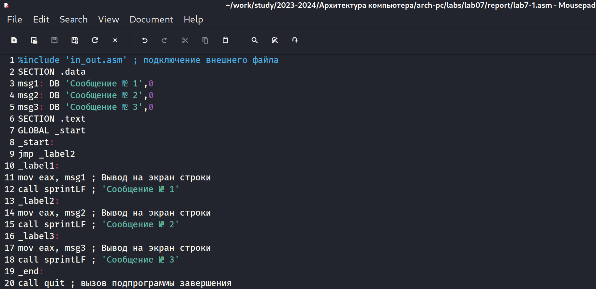{#fig:002 width=70%}

Создаю исполняемый файл и запускаю его.(рис. [-@fig:003])

{#fig:003 width=70%} 

Изменяю текст программы в соответствии с листингом 7.2.(рис. [-@fig:004])

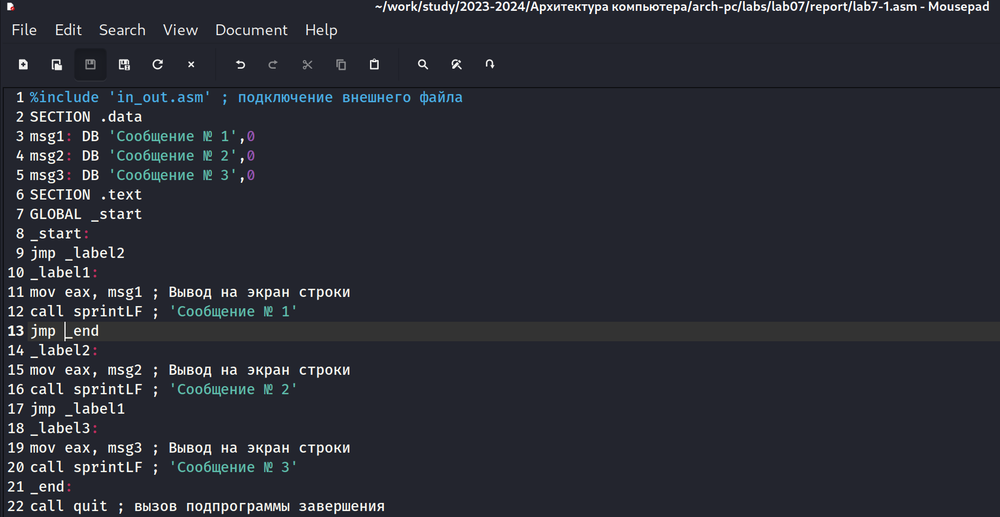{#fig:004 width=70%}

Создаю исполняемый файл и запускаю его.(рис. [-@fig:005])

{#fig:005 width=70%}

Далее изменяю файл так, чтобы он выводил "Сообщения" в обратном порядке.(рис. [-@fig:006])

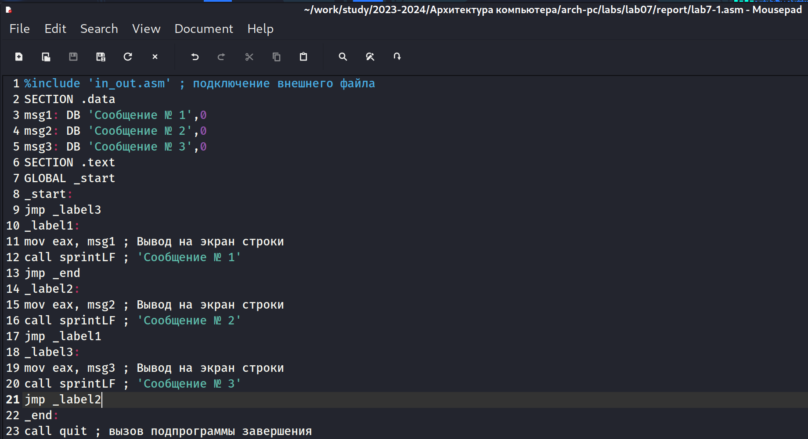{#fig:006 width=70%}

Создаю исполняемый файл и запускаю его.(рис. [-@fig:007])

{#fig:007 width=70%}

Убеждаюсь, что всё работает верно.

Создаю файл lab7-2.asm и вставляю в него текст программы из листинга 7.3.(рис. [-@fig:008])

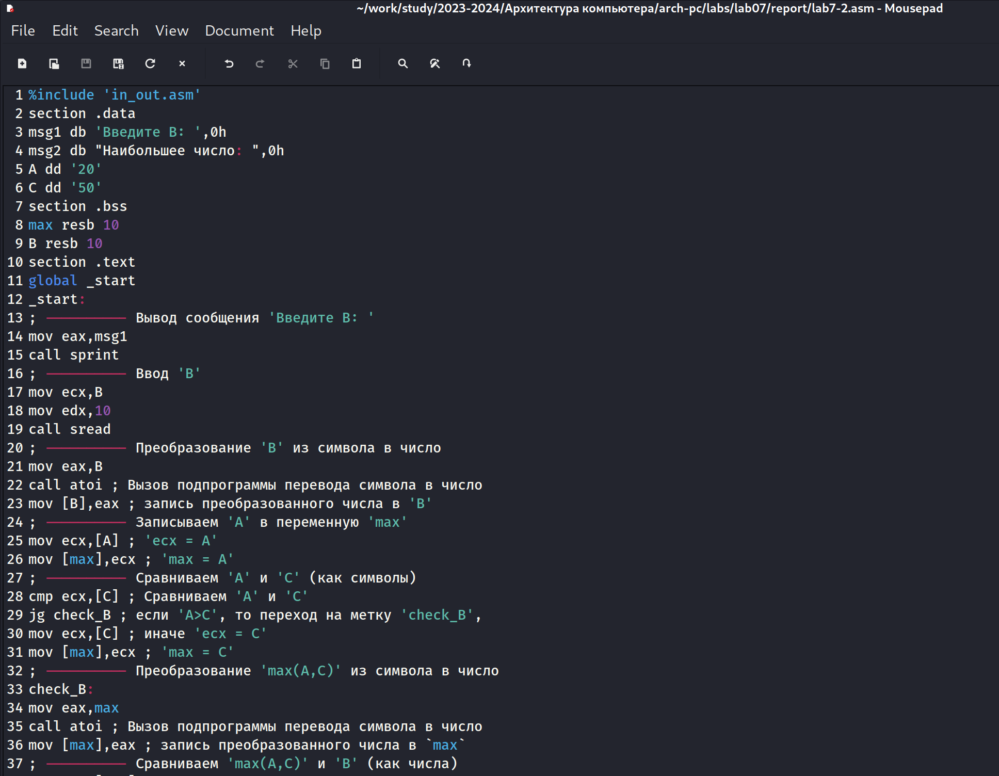{#fig:008 width=70%}

Создаю исполняемый файл и запускаю его.(рис. [-@fig:009])

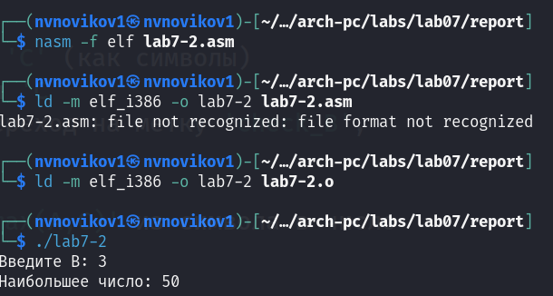{#fig:009 width=70%}

## Изуение структуры файла листинга

Создаю файл лситинга для программы из файла lab7-2.asm.(рис. [-@fig:010])

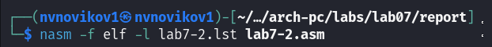{#fig:010 width=70%}

Далее открываю файл листинга lab7-2.lst.(рис. [-@fig:011])

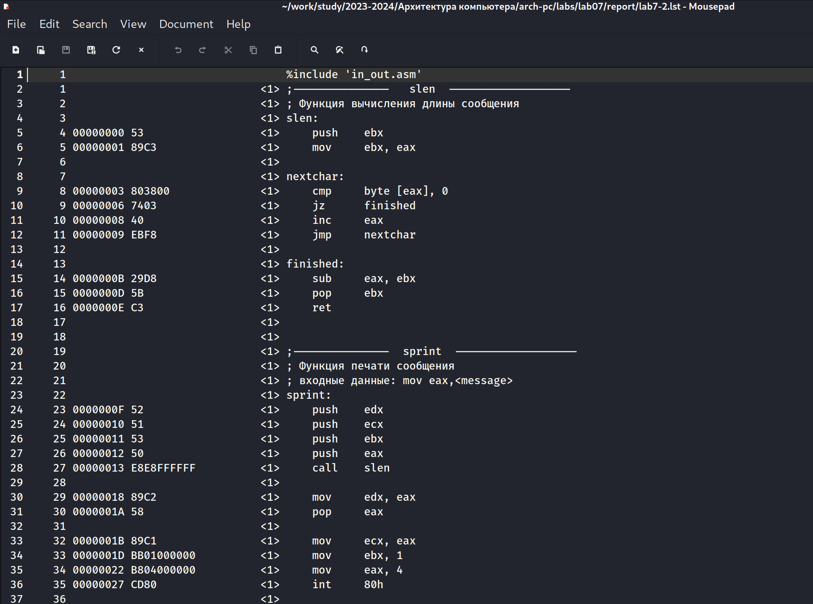{#fig:011 width=70%}

Опишу строчку номер 16:

Здесь
"15"-это номер строчки в коде программы
"0000000D"- это адрес 
"5В"- это машинный код
"ret" - исходный кол программы

Опишу строчку номер 36:

Здесь
"35"-это номер строчки в коде программы
"00000027"- это адрес 
"CD80"- это машинный код
"int" - исходный кол программы

Опишу строчку номер 24:

Здесь
"23"-это номер строчки в коде программы
"0000000F"- это адрес 
"52"- это машинный код
"push" - исходный кол программы

Теперь открываю файл с программой lab7-2.asm и удаляю один операнд в случайном месте.(рис. [-@fig:012])

{#fig:012 width=70%}

Пытаюсь создать файл листинга, но он не создается из-за ошибки.(рис. [-@fig:013])

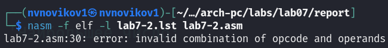{#fig:013 width=70%}

# Задание для самостоятельной работы

1. Создаю файл test.asm.(рис. [-@fig:014])

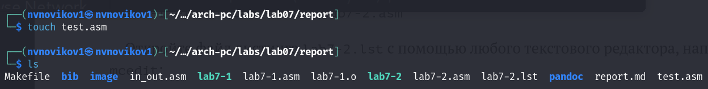{#fig:014 width=70%}

Далее открываю его и пишу программу для нахождения наименьшей из переменных a,b,c в соответствии с моим вариантом (вариант 20).(рис. [-@fig:015])

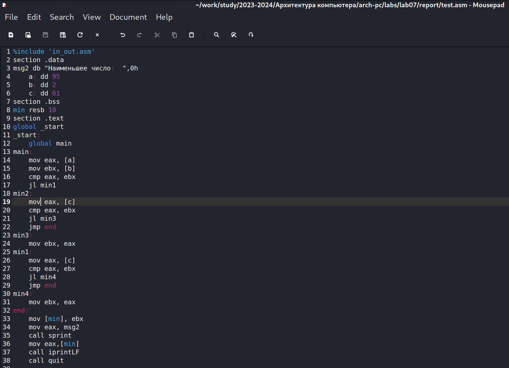{#fig:015 width=70%}

Создаю исполняемый файл и запускаю его.(рис. [-@fig:016])

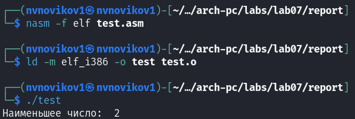{#fig:016 width=70%}

Программа работает верно

2. Создаю файл test2.asm.(рис. [-@fig:017])

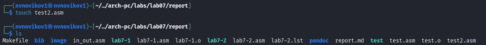{#fig:017 width=70%}

Начинаю написание программы, которая для введенных с клавиатуры значение x и a вычисляет значение заданной функции f(x) и выводит результат вычислений.(рис. [-@fig:018])

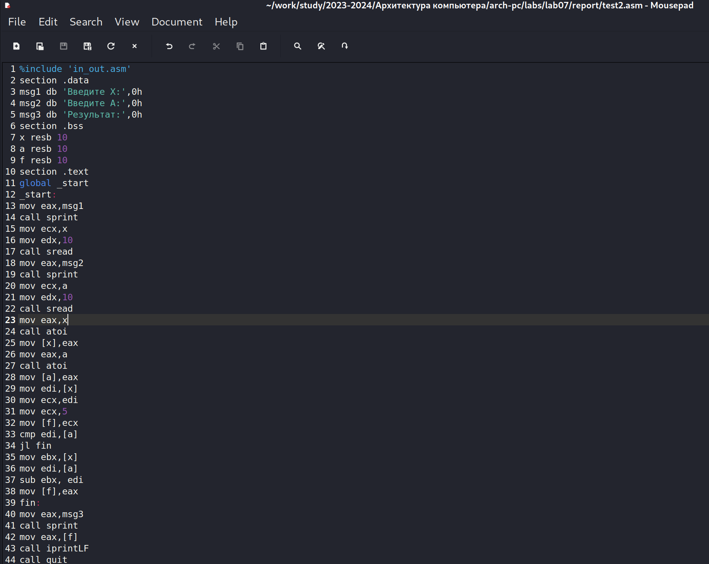{#fig:018 width=70%}

Создаю исполняемый файл и запускаю его.(рис. [-@fig:019])

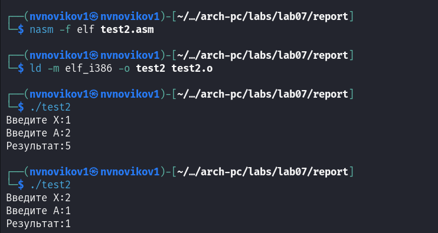{#fig:019 width=70%}

Программы работает верно

# Выводы

После выполнения данной лабораторной работы я изучил команды условного и безусловного переходов, приобрел навыки написания программ с использованием переходов и познакомился с назнчением и структурой файла листинга.

# Список литературы{.unnumbered}

::: {#refs}
:::
