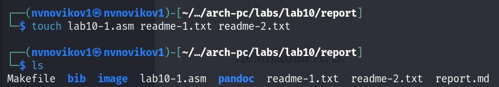
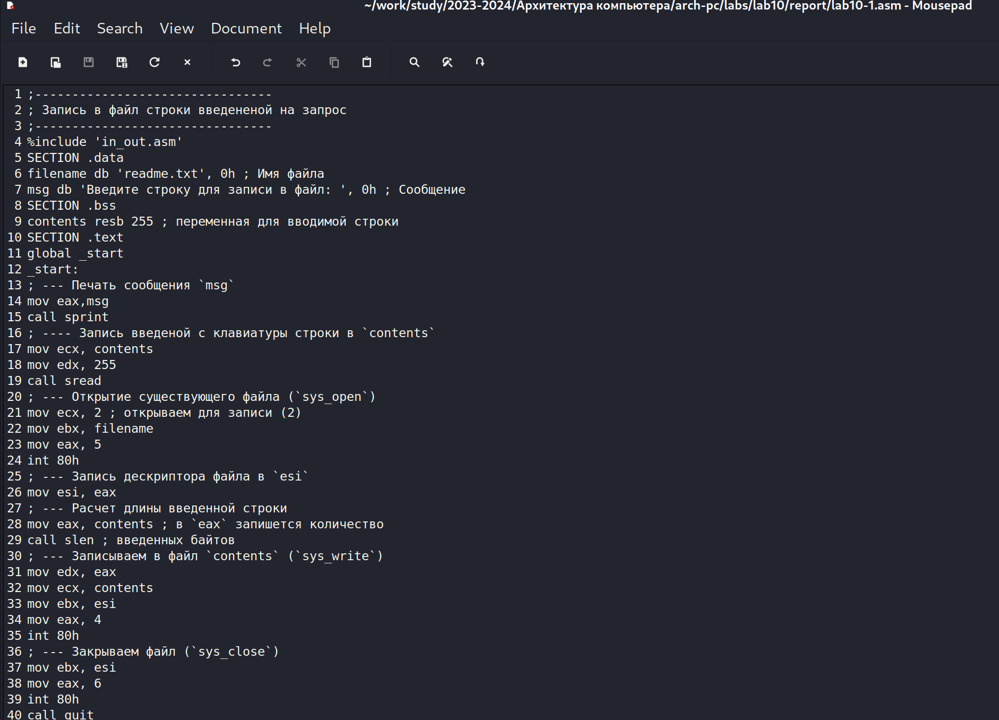
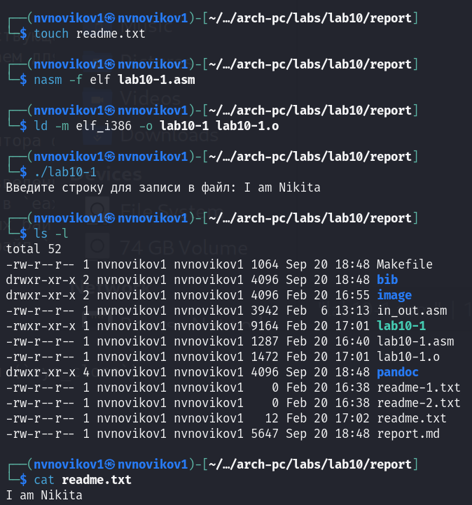
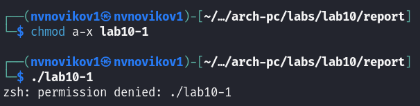
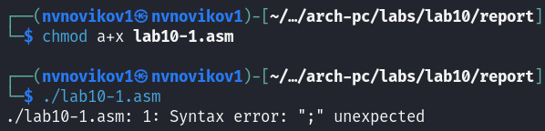
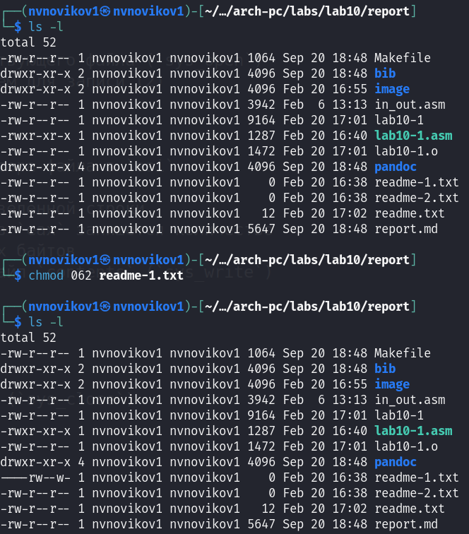
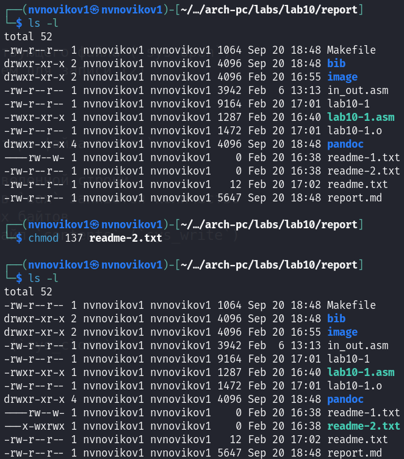
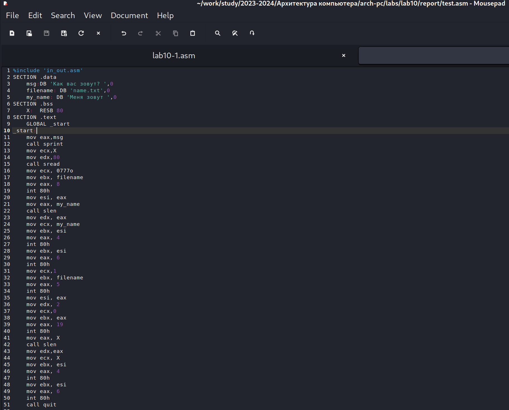
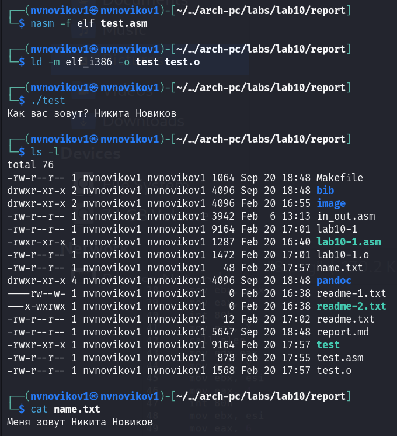

---
## Front matter
title: "Отчёт по лабораторной работе №10"
subtitle: "Архитектура компьютеров и операционные системы"
author: "Новиков Никита Владимирович"

## Generic otions
lang: ru-RU
toc-title: "Содержание"

## Bibliography
bibliography: bib/cite.bib
csl: pandoc/csl/gost-r-7-0-5-2008-numeric.csl

## Pdf output format
toc: true # Table of contents
toc-depth: 2
lof: true # List of figures
lot: true # List of tables
fontsize: 12pt
linestretch: 1.5
papersize: a4
documentclass: scrreprt
## I18n polyglossia
polyglossia-lang:
  name: russian
  options:
	- spelling=modern
	- babelshorthands=true
polyglossia-otherlangs:
  name: english
## I18n babel
babel-lang: russian
babel-otherlangs: english
## Fonts
mainfont: PT Serif
romanfont: PT Serif
sansfont: PT Sans
monofont: PT Mono
mainfontoptions: Ligatures=TeX
romanfontoptions: Ligatures=TeX
sansfontoptions: Ligatures=TeX,Scale=MatchLowercase
monofontoptions: Scale=MatchLowercase,Scale=0.9
## Biblatex
biblatex: true
biblio-style: "gost-numeric"
biblatexoptions:
  - parentracker=true
  - backend=biber
  - hyperref=auto
  - language=auto
  - autolang=other*
  - citestyle=gost-numeric
## Pandoc-crossref LaTeX customization
figureTitle: "Рис."
tableTitle: "Таблица"
listingTitle: "Листинг"
lofTitle: "Список иллюстраций"
lotTitle: "Список таблиц"
lolTitle: "Листинги"
## Misc options
indent: true
header-includes:
  - \usepackage{indentfirst}
  - \usepackage{float} # keep figures where there are in the text
  - \floatplacement{figure}{H} # keep figures where there are in the text
---

# Цель работы

Целью работы является приобретение навыков написания программ для работы с файлами.

# Задание

1. Изучение работы с файлами в ассемблере

2. Изучение примеров программ 

3. Изучение прав доступа

4. Выполнение заданий для самостоятельной работы

# Теоретическое введение

ОС GNU/Linux является многопользовательской операционной системой. И для обеспечения 
защиты данных одного пользователя от действий других пользователей существуют
специальные механизмы разграничения доступа к файлам. Кроме ограничения доступа, 
данный механизм позволяет разрешить другим пользователям доступ данным для совместной
работы.

Права доступа определяют набор действий (чтение, запись, выполнение), разрешённых
для выполнения пользователям системы над файлами. Для каждого файла пользователь
может входить в одну из трех групп: владелец, член группы владельца, все остальные. 
Для каждой из этих групп может быть установлен свой набор прав доступа. 
Владельцем файла является его создатель.

Набор прав доступа задается тройками битов и состоит из прав на чтение, запись и 
исполнение файла. В символьном представлении он имеет вид строк rwx, где вместо 
любого символа может стоять дефис. Всего возможно 8 комбинаций, приведенных в 
таблице 10.1. Буква означает наличие права (установлен в единицу второй бит триады 
r — чтение, первый бит w — запись, нулевой бит х — исполнение), а дефис означает 
отсутствие права (нулевое значение соответствующего бита). 
Также права доступа могут быть представлены как восьмеричное число. 
Так, права доступа rw- (чтение и запись, без исполнения) понимаются как три двоичные цифры 110 или как восьмеричная цифра 6.

Обработка файлов в операционной системе Linux осуществляется за счет использования
определенных системных вызовов. Для корректной работы и доступа к файлу при его от-
крытии или создании, файлу присваивается уникальный номер (16-битное целое число) –
дескриптор файла

# Выполнение лабораторной работы

Я создал специальный каталог для выполнения лабораторной работы №10 и перешел в него. Внутри этого каталога я создал три файла: lab10-1.asm, readme-1.txt и readme-2.txt. 

{ #fig:001 width=70%, height=70% }

В файле lab10-1.asm я написал программу, соответствующую листингу 10.1, которая предназначена для записи сообщения в файл.

{ #fig:002 width=70%, height=70% }

После этого я преобразовал исходный код в исполняемый файл и проверил его работоспособность.

{ #fig:003 width=70%, height=70% }

Чтобы отменить возможность выполнения исполняемого файла lab10-1, я запретил всем пользователям запускать данную программу. После попытки запуска нам было отказанно в доступе, так как мы запретили всем пользователям запускать данную программу.

{ #fig:004 width=70%, height=70% }

Я изменил настройки доступа к файлу lab10-1.asm, добавив разрешение на его выполнение с помощью команды chmod. После этого я попытался запустить файл.

В результате, файл был активирован, и терминал попытался выполнить его содержимое как команды командной строки. Однако, поскольку это файл с кодом на языке ассемблера, а не команды для терминала, возникли ошибки. Тем не менее, если в такой файл добавить команды командной строки, их можно будет выполнить, запустив файл.

{ #fig:005 width=70%, height=70% }

Далее, я настроил права доступа к файлам readme в соответствии с указаниями, представленными в таблице 10.4. Для проверки корректности выполнения, я использовал команду ls -l.

для варианта 20: ```--- rw- -w-``` ```001 011 111```

{ #fig:006 width=70%, height=70% }
{ #fig:007 width=70%, height=70% }

## Задание для самостоятельной работы

Написал программу работающую по следующему алгоритму:

- Вывод приглашения “Как Вас зовут?”

- ввести с клавиатуры свои фамилию и имя

- создать файл с именем name.txt

- записать в файл сообщение “Меня зовут”

- дописать в файл строку введенную с клавиатуры

- закрыть файл

{ #fig:008 width=70%, height=70% }

{ #fig:009 width=70%, height=70% }

# Выводы

Освоили работy с файлами и правами доступа.
